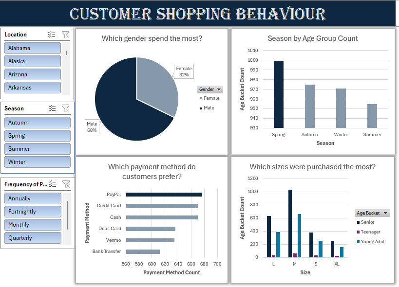
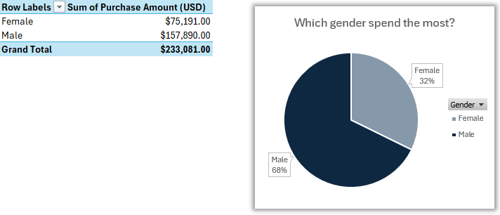
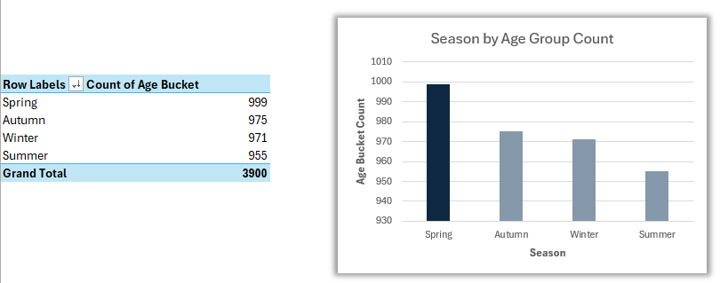
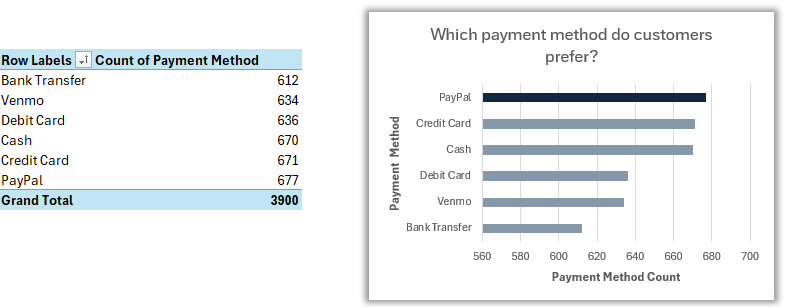
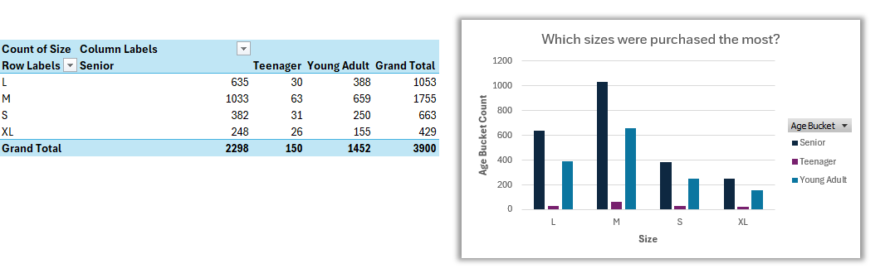

# Customer Shopping Behaviour Analysis

## Project Overview

This project analyses customer shopping behaviour to uncover patterns in spending, seasonality, payment preferences and product sizing. The goal is to translate raw transaction datasets with a total of 3900 rows into actionable business recommendations using core Excel data cleaning, logic and visualisation tools.

-  This project answered the following business questions:  

    - Which gender spends the most?
    - Which season generated highest revenue?
    - Which payment method do customers prefer?
    - Which sizes were purchased the most?

- The dashboard includes four linked visuals, filterable by **Location**, **Season** and **Frequency of Purchases**:

    - Gender spending
    - Seasonal trends
    - Payment method preferences
    - Size purchased by age bucket  

  

*Presented above is the full dashboard preview that was visualised in Excel.*

## Tools Used

- **Data Cleaning:**
    - SUBSTITUTE
    - Find and Replace
    - Remove Duplicates 

- **Logic:**
    - IF Statement to create customer segments for Age Bucket and Frequency of Purchases

- **Analysis:**
    - PivotTables
    - PivotCharts

- **Visualisation:**
    - Freeze Panes for easier navigation
    - Interactive PivotChart dashboard with slicers, this includes Location, Season and Frequency of Purchases

## Data Transformation Formulas

### 1. Age Segmentation (IF Statement)  

```excel
=IF(
    B2<20,"Teenager",
    IF(
        B2>=50,
        "Senior",
        "Young Adult"
    )
)
```
- Formula above was used in this project to group customer age into age bucket (teenager, young adult or senior) using a logical structure based on their age in column B.

- Segmenting customers into age buckets was necessary to compare purchasing behaviour across generational groups rather than analysing 3900 individual ages, making patterns like size preference and seasonal spending far easier to spot in the PivotTables and charts that follow.

### 2. Standardising Subscription Frequencies (SUBSTITUTE Formula)

```excel
=SUBSTITUTE(
    SUBSTITUTE(
        P2,
        "Bi-Weekly",
        "Fortnightly"),
        "Every 3 Months",
        "Quarterly"
)
```
- Purpose of this formula was to clean **Frequency of Purchases** column, text strings were standardised to represent modern billing intervals. Above is SUBSTITUTE formula performed.

- Without this cleaning step, entries like "Bi-Weekly" and "Fortnightly" would have been counted as separate categories despite meaning the same thing, which would have messed up the purchase frequency analysis and led to inaccurate conclusions about how often customers actually shop.

### 3. Key Analysis and Insights

**Gender Spending Performance**

 

- **Insight gained:** Based on gender comparison on who spends the most, males spend 38% more than females. This may either be the business focuses more on male products than females or female customers they don't prefer this store.

    - **Recommendation:** It is recommendable for the business to introduce products that may attract more females as well while keeping the marketing strategy they use for male customers.
    
**Seasonal Trends**



- **Insight:** Spring had the highest purchase volume across age groups, notably higher than Summer. This suggests that customers are more likely to make shopping during Spring time that other seasons.  

    - **Business Recommendation:** The business must consider overstocking seasonal categories in Spring as customers prefer doing shopping in this season. Additionally, the business should consider making use of marketing campaigns before Spring to maximize sales.

**Payment Method Popularity**



- **Insight:** The highest payment method used to make purchases was PayPal while customers show a strong preference against bank transfers. This suggests that customers prefer secure payment options.  

    - **Recommendation:** Promote additional secure payment options and educate customers on safer payment alternatives, for example, Visual Cards.

**Size Preferences by Age Group**  



- **Insight:** Medium (M) size was most purchased in all age groups while Extra-Large (XL) was the least purchased. This may be driven by medium sizing being the most common fit across the customer base.

    - **Recommendation:** Prioritise medium stock in replenishment orders and avoid overstocking XL until demand analysis is conducted.

## Conclusion

In conclusion, this project strengthened my practical Excel skills beyond basic spreadsheet use, giving me hands-on experience with the kind of data preparation and analysis work a Data Analyst does day-to-day. Working with SUBSTITUTE and IF formulas taught me how to think logically about data cleaning, rather than manually fixing inconsistent entries. I learned to build reusable formulas that standardise data at scale, which is a habit I will carry into future projects.

Building the PivotTables and PivotCharts shifted how I approach analysis instead of just calculating numbers. I had to think about which comparisons would actually answer a business question and how to present them so that non-technical stakeholders could interpret them easily. Using slicers and Freeze Panes pushed me to think about the user experience of the dashboard and not just its accuracy.

Perhaps the biggest takeaway was moving from "what does the data show" to "so what does the business do about it." Writing recommendations alongside each insight forced me to understand more about analyst field.
